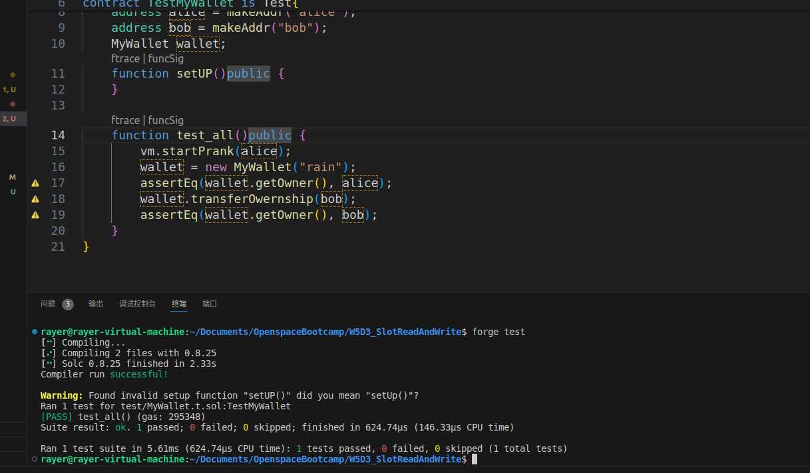

# Question

重新修改 MyWallet 合约的 transferOwernship 和 auth 逻辑，使用内联汇编方式来 set和get `owner` 地址。

```solidity

contract MyWallet { 
    public string name;
    private mapping (address => bool) approved;
    public address owner;

    modifier auth {
        require (msg.sender == owner, "Not authorized");
        _;
    }

    constructor(string _name) {
        name = _name;
        owner = msg.sender;
    } 

    function transferOwernship(address _addr) auth {
        require(_addr!=address(0), "New owner is the zero address");
        require(owner != _addr, "New owner is the same as the old owner");
        owner = _addr;
    }
}
```


# 运行截图


